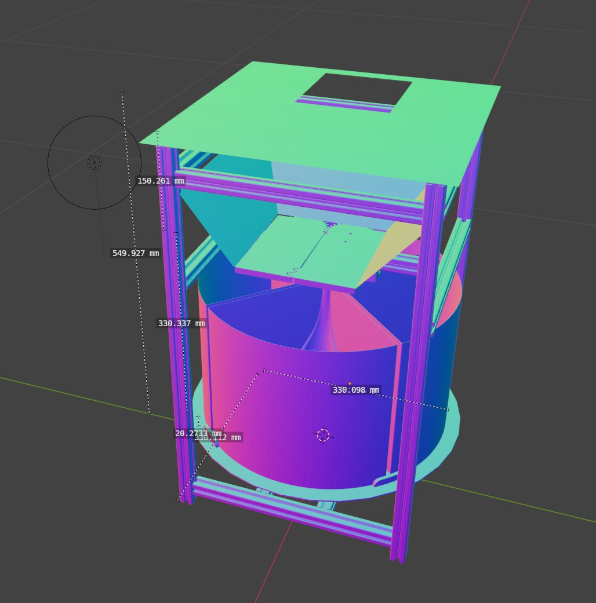
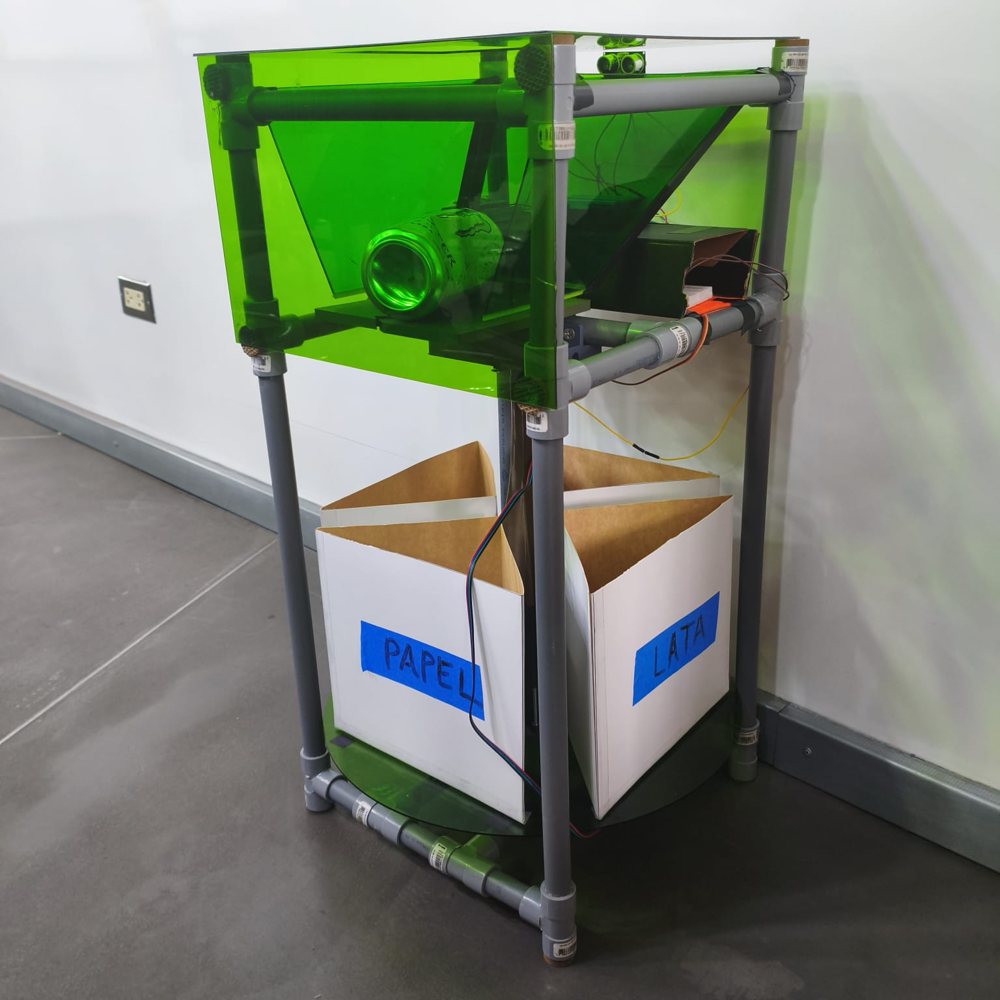
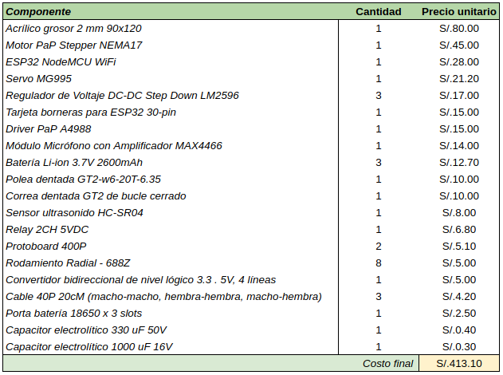
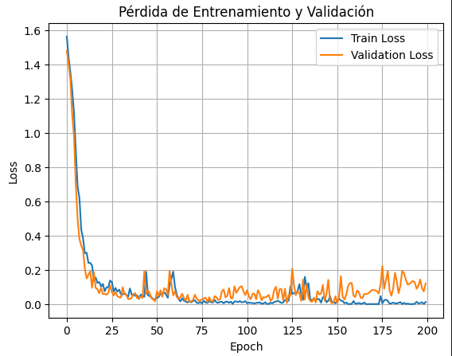
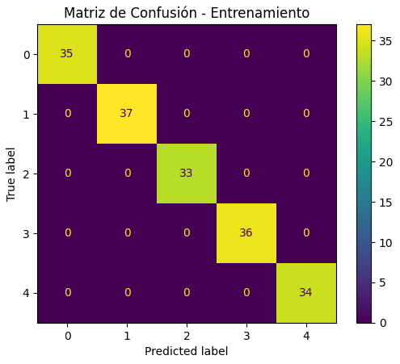
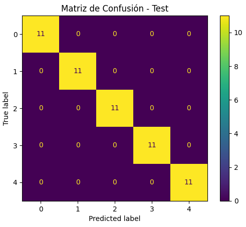

# 🗣️🗣️🗣️ UR SOUND IS TRASH 🗣️🗣️🗣️

    
    

# Principios físicos

    

# Descripción del prototipo

    

    
    

# Desempeño del modelo de clasificación

    

    
    

